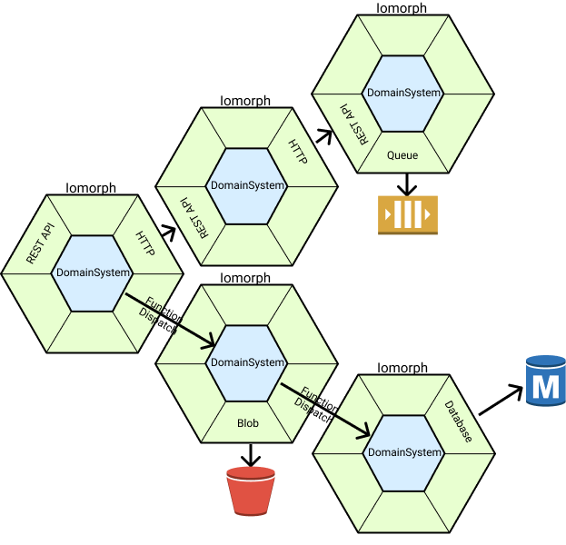

# Overview

Throughout this reference, we'll use example projects to orient our discussion:

* TODO

This reference is organized in the following major sections:

* Overview: how to read and use this reference, what the high-level ideas are, and the necessary background information.
* Atomic: how to build a single system compatible with the architecture.
* Composition: how to stitch various systems together.
* Evolution: how to coordinate change across systems in order to safely modify behavior.

## Systems and Iomorphs

The key perspective that acts as the foundation for the Iomorphic Architecture is the idea of a _domain system_.  Eric Evans, in Domain-Driven Design, originates this idea of having code follow a business domain closely, but the idea is more easily illustrated in the Hexagonal Architecture:

The point, of course, is that no matter how a system communicates with other systems, there is some blob of domain logic that represents the core of the system itself.  These blobs, conceptually, _are_ the systems, and everything else is merely the implementation detail of how we wire them together to communicate with each other.  Consider the following:

The Iomorphic Architecture recognizes this structure and seeks to use it to solve the problems organizations face as their systems grow and become more inherently complex:

1. You will need to have more than one domain system.
2. You will make mistakes when it comes to drawing your system boundaries.
3. Technology choices you make will inevitably become outdated as the world changes.

The Iomorphic Architecture starts with these problems, and then asks: how can we resolve these problems while enabling low overhead and high flexibility at high organizational scale?  This results in the two core principles of the architecture:

1. **Unified Modeling.**  Scaling an organization _requires_ the ability to encapsulate domains, but having the same building block to model all domains regardless of their size or place makes it easy to deal with the inevitable mistakes you'll make drawing their boundaries.
2. **Isomorphic Communication**.  More importantly, specific technology choices for how systems should communicate and be isolated will inevitably become outdated, and any migration will require the coexistence of multiple such technologies.  \(A simple proof: do you use both function dispatch and HTTP?\)  Preserving the ability to fix mistakes _requires_ decoupling how you _model_ your systems from how you _wire_ your systems together - otherwise, every modeling mistake will involve painstaking work changing function calls to HTTP dispatch.  The architecture does not dictate _specific_ technology choices, only that they not leak into your domain systems.

To fully illustrate how this would work:

The Iomorphic Architecture is built up from Iomorphs.  Each **Iomorph** is built in the style of the Hexagonal Architecture - it is the code manifestation of a domain system, but paired with all of the **adapters** that permit _communication_ across whichever _isolation mechanism_ you are using to encapsulate that Iomorph.

It should be carefully noted that we do not use the term "service" here - while an Iomorph retains all of the **encapsulation requirements** of a "service" \(public API as a contract, SLAs, etc.\), it does not have to run on its own VM or container, and it does not have to utilize HTTP for communication with other Iomorphs.  It is up to you to decide, for each Iomorph, what degree of separation is truly required.

Individual Iomorphs are composed together by communicating across isolation mechanisms.  Each **isolation mechanism** \(e.g. programming language modules\) has a way to **communicate** \(e.g. function dispatch\) across it.  There are a few composition rules governing how Iomorphs can be combined together, which forms a graph where the communication links form the edges.

This results in the following high-level structure:

1. All source code lives in a single VCS repository \(Monorepo\).
2. Each **Atomic** Iomorph has its own folder, and is built in a style that is very similar to the Hexagonal or Clean Architectures.
3. Atomic Iomorphs can be **composed** together according to a couple of rules \(Peering, Hierarchy\).

As we'll see in the more detailed sections to come, this architecture empowers us to have a diverse set of systems, a heterogeneous set of isolation mechanisms, the ability to easily correct domain boundary mistakes, and the ability to retain the benefits of a monolith for a long time without incurring technical debt.

