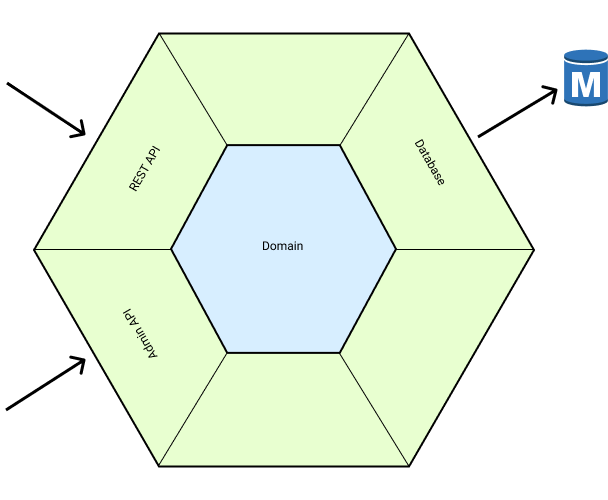

# Overview

Throughout this reference, we'll use example projects to orient our discussion:

* TODO

This reference is organized in the following major sections:

* Overview: how to read and use this reference, what the high-level ideas are, and the necessary background information.
* Atomic: how to build a single system compatible with the architecture.
* Composition: how to stitch various systems together.
* Evolution: how to coordinate change across systems in order to safely modify behavior.

## Systems and Iomorphs

The key perspective that acts as the foundation for the Iomorphic Architecture is the idea of a _domain system_.  Eric Evans, in Domain-Driven Design, originates this idea of having code follow a business domain closely, but I think the idea is most easily illustrated in the Hexagonal Architecture:

The point, of course, is that no matter how a system communicates with other systems, _**conceptually**_, there is some blob of domain logic that represents the core of the system itself.  These blobs, conceptually, _are_ the systems, and everything else is merely the implementation detail of how we wire them together to communicate with each other.  Consider the following:

HTTP vs. FUNCD SYSTEM WIRING IMAGE TODO

In designing a new _architecture_, we started by looking at the inevitable problems that any organization will face when tackling complex problems:

1. You will need to have more than one domain system.
2. You will make mistakes when it comes to drawing your system boundaries.
3. Technology choices you make will inevitably become outdated as the world changes.
4. You will need to use more than one method for encapsulating domain systems.

Of these principles, the first three are probably self-evident, while the last might require some exposition.  Imagine that you had started building your systems in the year 2000, with a SOAP-style RPC communication mechanism.  As REST APIs became more prevalent over the next decade, a natural inevitability would be the evolution of your system interconnects from SOAP to REST, which would necessitate some period of time where _both_ would need to exist in your ecosystem.  Similar kinds of transitions would be the current shift from VMs to Containers, or from REST to GRAPHQL.  This specific point is that _how you isolate systems_ is a **technology choice**, which will inevitably become outdated over time, and will necessitate the ability to utilize more than one such mechanism at a time.  Even beyond that, however, different _isolation mechanisms_ have different _trade-offs_, which means the ability to utilize more than one such method allows you to select the _right method for the job_.

The Iomorphic Architecture starts with these problems, and then asks: how can we resolve these problems while enabling low overhead and high flexibility at high organizational scale?  This results in the two core principles of the architecture:

1. **Isolation of Systems**.  Scale requires abstraction and encapsulation, and any architecture must start from the perspective of systems that can be worked on in isolation.
2. **Isomorphic under Isolation**.  Systems are built so that the _**core domain logic**_ does not change when the mechanism used to encapsulate the system from others is changed.  The architecture itself does not recommend any specific _isolation mechanisms_.  Each has its own set of trade-offs, and we leave it to the implementing organization to choose the **set** of isolation mechanisms that best meets its needs.  The architecture is intended to work _**regardless**_ of which ones you choose, and whether that choice changes.

IOMORPHIC ARCH IMAGE TODO

The Iomorphic Architecture is built up from **Iomorphs**.  Each **Iomorph** is built in the style of the Hexagonal Architecture - it is the code manifestation of a domain system, but paired with all of the **adapters** that permit communication across whichever **isolation mechanism** you have chosen.  It should be specifically noted that we do not use the term "service" here - while an Iomorph retains all of the _**encapsulation requirements**_ of a "service" \(public API as a contract, SLAs, etc.\), it does not have to run on its own VM or in its own container, and it does not have to utilize HTTP for communication with other Iomorphs.

Individual Iomorphs are **composed** together by **communicating across isolation mechanisms**.  Each **isolation mechanism** \(e.g. programming language modules\) have a way to **communicate** \(e.g. function dispatch\) across.  There are a few **composition rules** governing how Iomorphs can be combined into a graph, and these communication mechanisms form the edges.

This results in the following high-level structure:

1. All source code lives in a single VCS repository \(Monorepo\).
2. Each **Atomic** Iomorph has its own folder, and is built in a style that is very similar to the Hexagonal or Clean Architectures.
3. Atomic Iomorphs can be **composed** together according to a couple of rules \(Peering, Hierarchy\).

As we'll see in the more detailed sections to come, this architecture empowers us to have a diverse set of systems, a heterogeneous set of isolation mechanisms, the ability to easily correct domain boundary mistakes, and the ability to use low-overhead isolation mechanisms such as function dispatch for as long as possible without incurring long-term technical debt.

