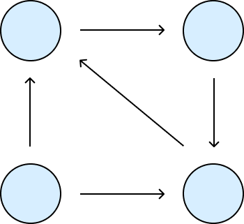
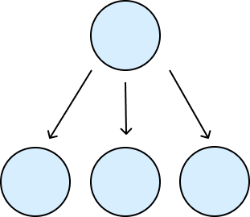
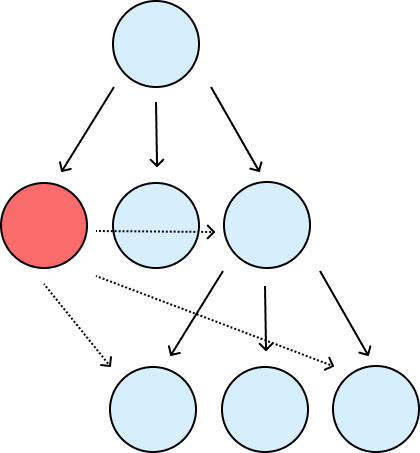

# Iomorphs

An **Iomorph** is the _generalized_ version of a "Service".  It holds the "System", which is the conceptual representation of the actor/agent encapsulating a domain \(independent from any specific mechanism used to communicate with it\), as well as the adapters that determine how other Iomorphs are able to interact with this System.

Iomorphs have mostly the same requirements as a "Service": a public API, encapsulation, SLAs, contracts, but are not tied to HTTP.  Indeed, the only requirement is that an Iomorph must choose _some_ Isolation Mechanism to hide its encapsulated System from other Iomorphs, but the architecture does not impose a particular technology choice on what should be a domain and context-specific decision.  It accepts whichever Isolation Mechanism you deem appropriate.

A more concrete example: an Iomorph might start off its existence by using function dispatch to communicate with another Iomorph.   If it eventually switches to exposing a REST API and using an HTTP client to communicate instead - conceptually, we still think of it as the _**same**_ Iomorph and System.  Consider the following:

**Every Iomorph encapsulates a System**, and **every Iomorph may independently choose** _**which**_ **Isolation Mechanism it wants to use to encapsulate its System**.  This decouples the concerns of how to _represent_ domains from how to _isolate_ them.

Of course, just as people asked "How big should a microservice be?" and Uber asked "How big should a DOMA be?", you might ask: "How big should an Iomorph be?"  The truth is that no framework can give you a universally correct answer.  Decomposing a problem into constituent domains is a _domain_ and _context-specific_ problem: You can take the same problem, but a team of 5 and a team of 50 may want to tackle it in different ways.  Doing this well relies on experience with the problem, knowledge of timeless principles \(Domain-Driven Design is a great primer\), and a willingness to experiment and evolve.

The purpose of this architecture is not to tell you how big or small an Iomorph should be, since there will _never_ be a universally correct answer.  Rather, it is to give you a tool \(the Iomorph\) as a building block to represent _all_ of your systems, and to then make it possible to easily _evolve_: both by changing which Isolation Mechanism you want to use, and to change the boundaries of the Iomorphs themselves.

When you understand your problem space well enough to say "these are the critical domains, and this is how different Isolation Mechanisms should map to those domains" - this is extremely compatible with the Iomorphic Architecture.  Our purpose is to allow you to start at a point where you understand very little, make mistakes, and evolve to that point without incurring technical debt along the way.

## Composition

There are three main patterns for how we think about the relationships between Iomorphs.

### Peering

**Peering** is what most people are familiar with.  Iomorph **Peers** are allowed to talk to each other, through whichever communication mechanisms they each support.  The only requirement is that in a given peering group, the _same_ Isolation Mechanism is used to separate all of the Iomorphs.

### Hierarchy

A **Hierarchical** relationship is when one Iomorph \(the parent\) _encapsulates_ another Iomorph \(the child\).  Specifically, the **parent** uses an Isolation Mechanism to prevent its **Peers** from communicating with its **Children**.  The **children** of an Iomorph do not have any requirements for their inter-relationships - they may all be peers, they may all be standalone peering groups, or somewhere in the middle.

### Infrastructure

There is one main exception, which are the **Infrastructure** Iomorphs that need to implement some horizontal, cross-cutting concern, which may necessitate the breaking of certain encapsulation boundaries.

The primary rule is the **Infrastructure** Iomorph itself may directly communicate with _**any descendant**_ of its parent.  This means siblings, children of siblings, and so on and so forth.

## Conclusion

This provides the conceptual basis that underpins the Iomorphic Architecture.  What follows is the description of how one can structure a codebase following these principles in order to achieve a highly flexible architecture that is responsive to business needs while preserving the ability to make pragmatic and thoughtful technical decisions.

